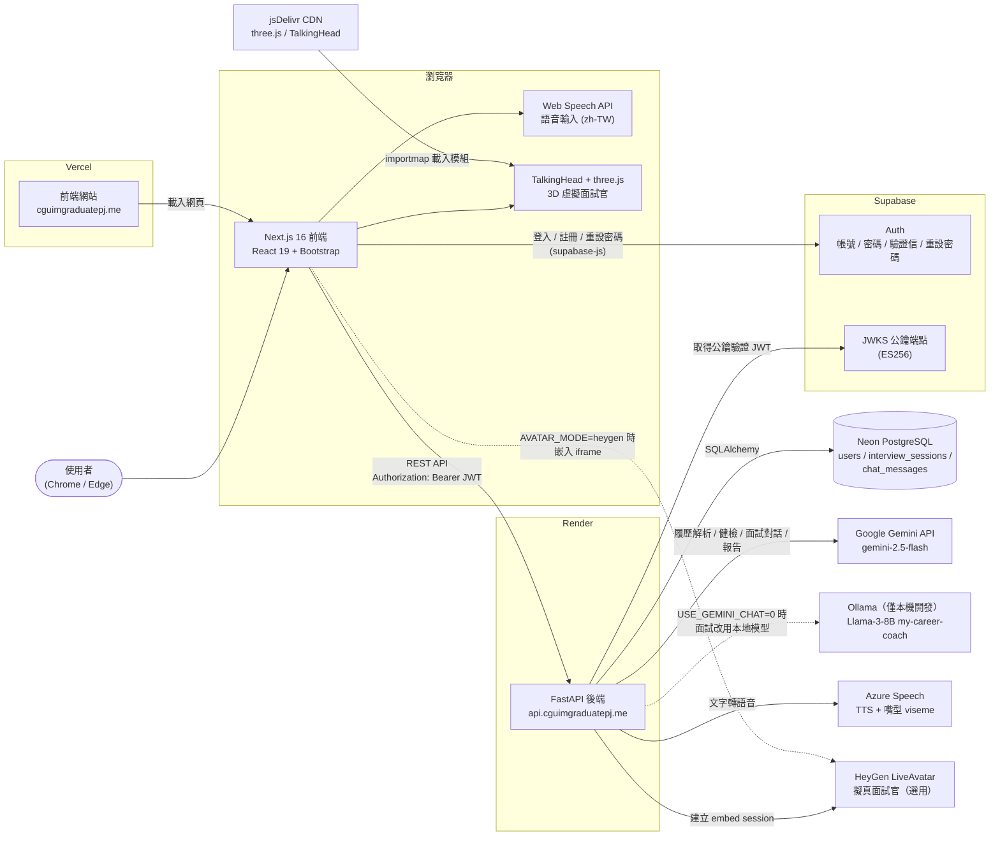
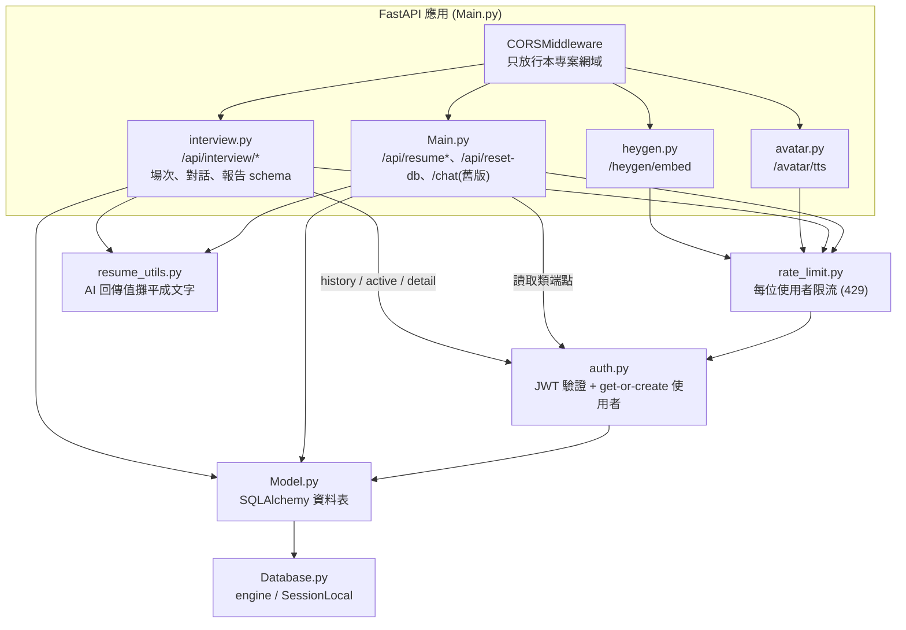
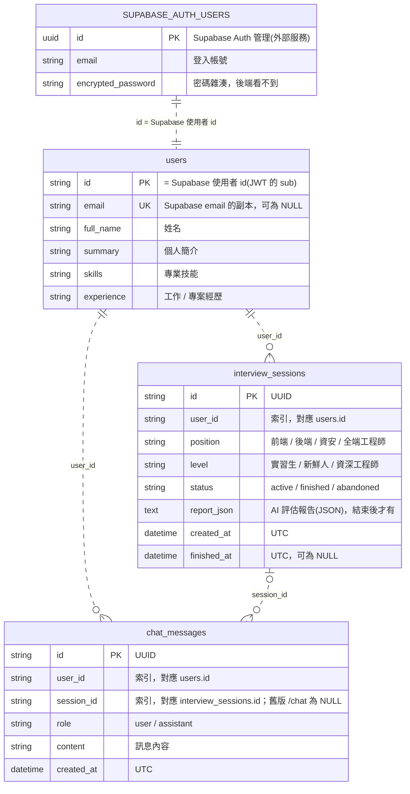
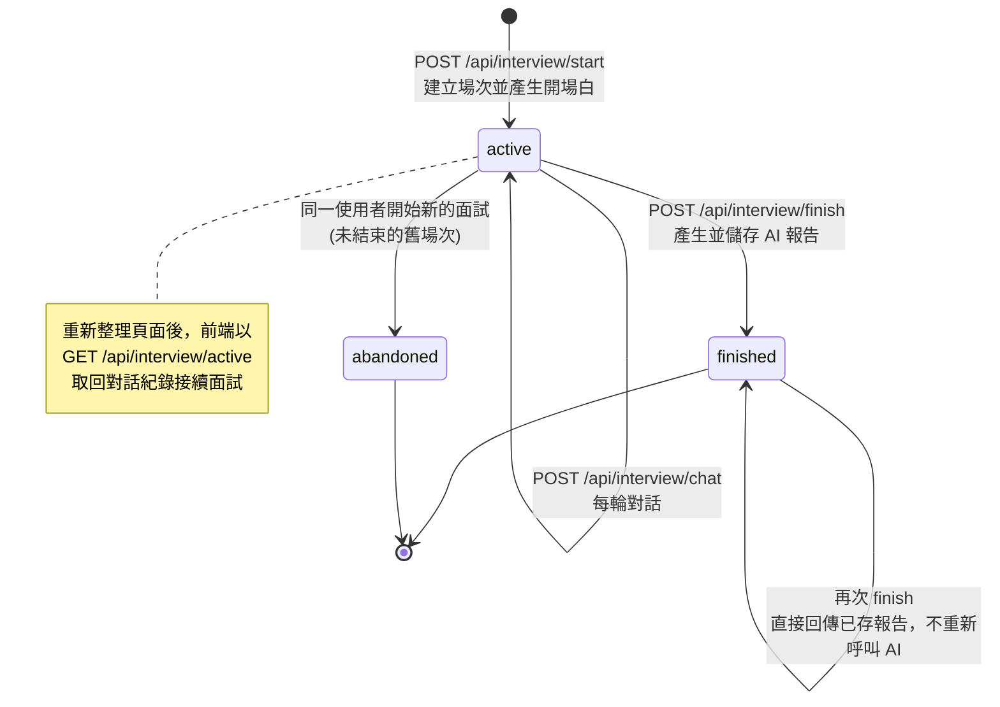
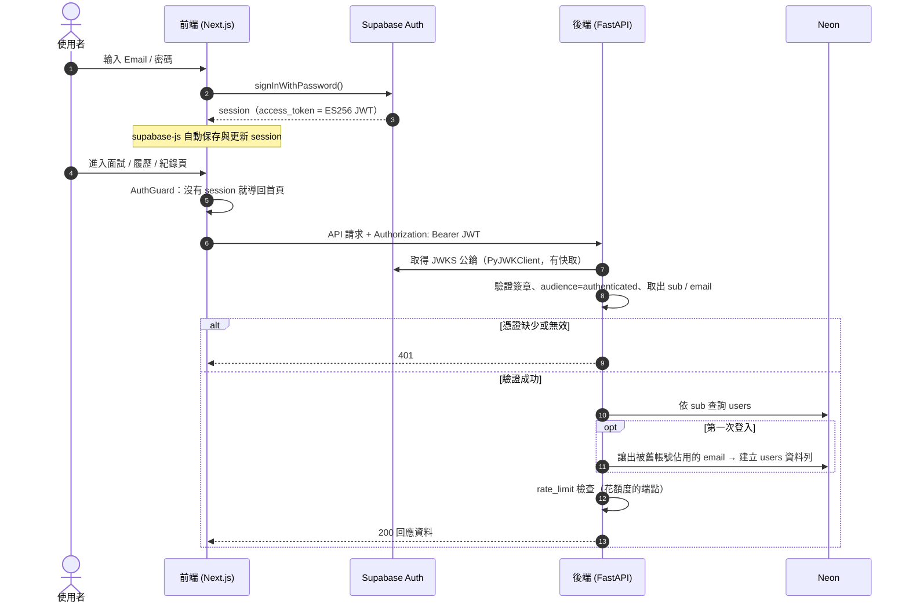
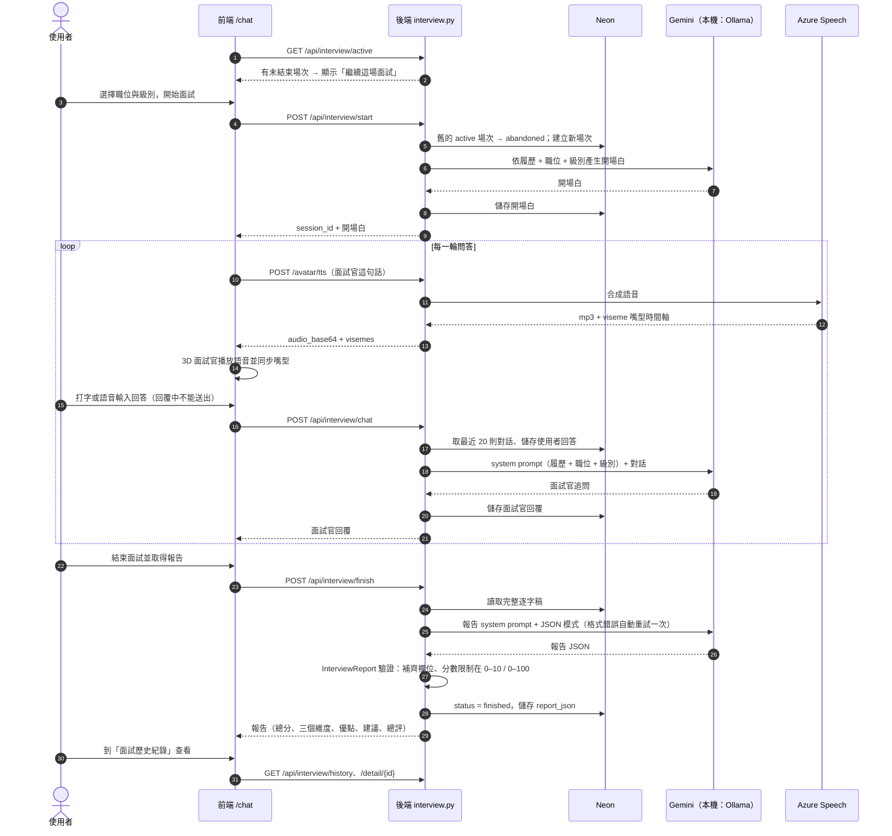
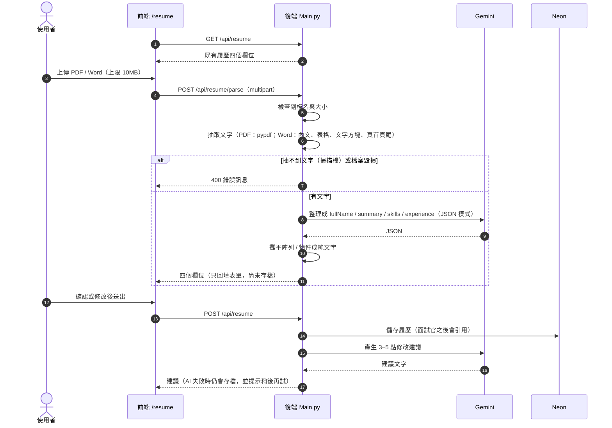

# 系統架構與資料庫設計

本文件依照目前程式碼（`master` 分支）繪製，圖表使用 [Mermaid](https://mermaid.js.org/) 語法，GitHub 會直接渲染成圖。
需要放進專題報告時，可將各段 ` ```mermaid ` 區塊內容貼到 [mermaid.live](https://mermaid.live) 匯出 PNG / SVG。

- [1. 系統架構圖（部署與外部服務）](#1-系統架構圖部署與外部服務)
- [2. 後端模組圖](#2-後端模組圖)
- [3. ERD（資料庫實體關係圖）](#3-erd資料庫實體關係圖)
- [4. 面試場次狀態圖](#4-面試場次狀態圖)
- [5. 循序圖：登入與 API 身份驗證](#5-循序圖登入與-api-身份驗證)
- [6. 循序圖：模擬面試完整流程](#6-循序圖模擬面試完整流程)
- [7. 循序圖：履歷上傳解析與 AI 健檢](#7-循序圖履歷上傳解析與-ai-健檢)
- [8. API 一覽](#8-api-一覽)

---

## 1. 系統架構圖（部署與外部服務）



**說明**

| 元件 | 角色 | 設定位置 |
|---|---|---|
| Vercel | 前端（Next.js）部署，`master` 推送後自動部署；其他分支產生 Preview | `NEXT_PUBLIC_*` 環境變數 |
| Render | 後端（FastAPI / uvicorn）部署，`master` 推送後自動部署 | Render Environment（`render.yaml` 僅供參考，服務未啟用 Blueprint 同步） |
| Supabase | **只負責帳號**（Auth）；後端不存密碼，只用 JWKS 公鑰驗證前端帶來的 JWT | `SUPABASE_URL` / `NEXT_PUBLIC_SUPABASE_*` |
| Neon | 應用資料（履歷、面試場次、對話）；本機開發改用 SQLite（`app.db`） | `DATABASE_URL` |
| Gemini | 履歷解析、履歷健檢；正式環境（`USE_GEMINI_CHAT=1`）也負責面試對話與報告 | `GEMINI_API_KEY` / `GEMINI_MODEL` |
| Ollama | 本機開發時的面試模型（`USE_GEMINI_CHAT=0`），Render 上沒有安裝 | `OLLAMA_HOST` / `OLLAMA_MODEL`、`Modelfile` |
| Azure Speech | 面試官語音與嘴型時間軸（區域 `southeastasia`） | `AZURE_SPEECH_*` |
| HeyGen | 擬真面試官模式（`NEXT_PUBLIC_AVATAR_MODE=heygen`），對話由 HeyGen 雲端處理，不經過面試場次系統 | `LIVEAVATAR_*` |

---

## 2. 後端模組圖



- 會消耗 AI / 語音 / HeyGen 額度的 POST 端點都經過 `rate_limit.rate_limited()`，它內部再呼叫 `auth.get_current_user`；只讀取資料的端點直接用 `get_current_user`。
- `tests/test_security.py` 會檢查每個花額度的端點都有掛限流，之後新增端點若漏掛會被測試抓到。

---

## 3. ERD（資料庫實體關係圖）



**設計說明（撰寫報告時可引用）**

- **帳號與應用資料分離**：密碼、驗證信、重設密碼全部交給 Supabase Auth；`users` 只存履歷欄位，主鍵直接使用 Supabase 的使用者 id（JWT 的 `sub`）。使用者第一次呼叫受保護 API 時，由 `auth.get_current_user` 自動建立資料列（get-or-create）。
- **關聯為邏輯關聯（圖中虛線）**：程式以 `user_id`、`session_id` 欄位關聯並建立索引，但資料庫層沒有 FOREIGN KEY 約束；刪除 Supabase 帳號時，Neon 中的資料不會連帶刪除。
- **同 email 重新註冊**：Supabase 保證同一時間一個 email 只屬於一個帳號，若本地有「其他 id」仍佔用該 email（已刪除的舊帳號），會先把舊資料列的 email 清空再建立新帳號；舊履歷與面試紀錄保留，但不會轉給新帳號。
- **報告以 JSON 字串存在 `report_json`**：讀寫時都經過 `interview.InterviewReport`（Pydantic）補齊欄位與校正分數範圍，前端永遠拿到完整結構。
- **時間一律存 UTC**，回傳給前端前轉成台灣時間（UTC+8）。
- **Schema 管理**：啟動時 `Base.metadata.create_all()` 只會新增不存在的資料表；既有資料表要改欄位時，需在 Render 暫時設定 `ALLOW_DB_RESET=1` 並呼叫 `POST /api/reset-db`（會清空資料，見 README 常見問題）。

---

## 4. 面試場次狀態圖



- 同一位使用者同時最多只有一場 `active` 場次。
- `abandoned` 的場次不能再對話或產生報告（回 400），也不會出現在歷史紀錄。
- 報告產生失敗（AI 連線錯誤或格式錯誤）時，場次維持 `active`，使用者可以再按一次「結束面試」。

---

## 5. 循序圖：登入與 API 身份驗證



---

## 6. 循序圖：模擬面試完整流程



---

## 7. 循序圖：履歷上傳解析與 AI 健檢



---

## 8. API 一覽

| 方法 | 路徑 | 說明 | 身份驗證 | 限流 |
|---|---|---|---|---|
| GET | `/` | 健康檢查 | — | — |
| GET | `/api/resume` | 讀取目前使用者的履歷 | JWT | — |
| POST | `/api/resume` | 儲存履歷並取得 AI 健檢建議 | JWT | 10 次 / 10 分鐘 |
| POST | `/api/resume/parse` | 上傳 PDF / Word，AI 解析成履歷欄位 | JWT | 10 次 / 10 分鐘 |
| POST | `/api/interview/start` | 開始面試（職位、級別），回傳開場白 | JWT | 10 次 / 10 分鐘 |
| POST | `/api/interview/chat` | 場次內對話 | JWT | 20 次 / 分鐘 |
| POST | `/api/interview/finish` | 結束面試並產生報告 | JWT | 10 次 / 10 分鐘 |
| GET | `/api/interview/active` | 取得未結束的場次（接續面試） | JWT | — |
| GET | `/api/interview/history` | 已完成的面試列表 | JWT | — |
| GET | `/api/interview/detail/{id}` | 單場報告與逐字稿 | JWT | — |
| POST | `/avatar/tts` | Azure 文字轉語音 + 嘴型時間軸 | JWT | 40 次 / 分鐘 |
| POST | `/heygen/embed` | 建立 HeyGen 擬真面試官 iframe | JWT | 5 次 / 小時 |
| POST | `/chat` | 舊版不分場次的對話（前端已不使用） | JWT | 20 次 / 分鐘 |
| POST | `/api/reset-db` | 清空並重建資料表（需 `ALLOW_DB_RESET=1` 與 `X-Admin-Secret`） | Admin secret | — |

互動式 API 文件：啟動後端後開啟 `http://localhost:8001/docs`（FastAPI 自動產生）。
